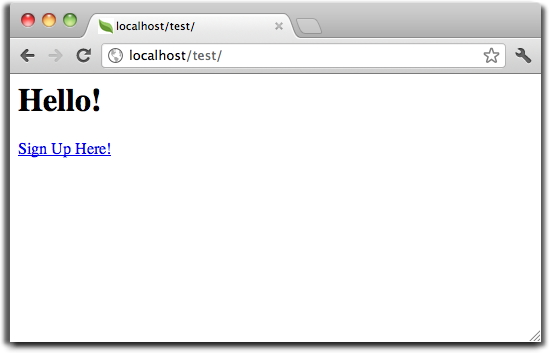
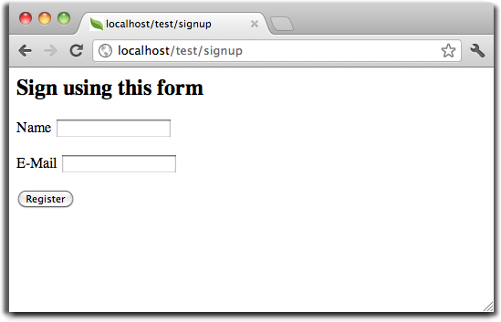

Tutorial 1: Vamos aprender com o exemplo
==================================
Ao longo desse primeiro tutorial vamos orienta-lo a criar uma aplicação, a partir da estaca zero, a construção de um simples formulário de cadastro de usuários. Nós também explicaremos aspectos básicos do comportamento do framework. Se você estiver interessado em ferramentas de geração automática de código para o  Phalcon, você pode verificar nossa documentação :doc:`ferramentas de desenvolvimento <tools>`.

Verificando nossa instalação
--------------------------
Nós iremos assumir que você já tenha o Phalcon instalado. Verifique a saída do seu phpinfo() na seção referente ao "Phalcon" ou execute o seguinte código abaixo:

.. code-block:: php

    <?php print_r(get_loaded_extensions()); ?>

A extensão do Phalcon deverá aparecer como parte da saída do código executado acima, como mostra o exemplo abaixo:

.. code-block:: php

    Array
    (
        [0] => Core
        [1] => libxml
        [2] => filter
        [3] => SPL
        [4] => standard
        [5] => phalcon
        [6] => pdo_mysql
    )

Criando um Projeto
------------------
A melhor maneira de utilizar esse guia é seguir um passo de cada vez. Você poderá obter o código completo dessa aplicação no link: <https://github.com/phalcon/tutorial>`_. 

Estrutura dos Arquivos
^^^^^^^^^^^^^^
O Phalcon não impõem uma estrutura particular dos arquivos para o desenvolvimento de uma aplicação. Esse fato é devido ao seu baixo acoplamento, você pode implementar uma aplicação potencializada com o Phalcon com uma estrutura de arquivos que você estiver mais familiarizado na codificação do seu dia-a-dia.

Para os fins desse tutorial e como ponto de partida, nós sugerimos a seguinte estrutura:

.. code-block:: php

    tutorial/
      app/
        controllers/
        models/
        views/
      public/
        css/
        img/
        js/

Observe que você não precisa de nenhum diretório "library" relacionado ao framework Phalcon. O framework esta disponível em memória pronto para o seu uso.

URLs Amigáveis
^^^^^^^^^^^^^^
Nó iremos usar urls amigáveis para esse tutorial. URLs amigáveis são melhores para SEO, assim como são fáceis de serem lembradas pelos os usuários. Phalcon suporta os módulos de rewrite (modulo de reescrita de urls) fornecido pela maioria dos servidores webs mais populares. Fazendo com que as urls amigáveis da sua aplicação não seja um requerimento, e você poderá desenvolver facilmente sua aplicação sem elas.

Nesse exemplo nós usaremos o modulo rewrite do Apache. Vamos criar um par de regras do rewrite no /.htaccess:

.. code-block:: apacheconf

    #/.htaccess
    <IfModule mod_rewrite.c>
        RewriteEngine on
        RewriteRule  ^$ public/    [L]
        RewriteRule  (.*) public/$1 [L]
    </IfModule>

Todas as requisições do projeto serão reescritas para o diretório public/, fazendo-o como o diretório raiz da aplicação. Esta etapa garante que todo o restante dos diretórios da aplicação permaneçam ocultos para visualização publica, e desta forma evitando problemas quanto a risco da segurança da aplicação.

O segundo conjunto de regras irá verificar se o arquivo requisitado existe, e caso exista ele não deverá ser reescrito pelo módulo do servidor web:

.. code-block:: apacheconf

    #/public/.htaccess
    <IfModule mod_rewrite.c>
        RewriteEngine On
        RewriteCond %{REQUEST_FILENAME} !-d
        RewriteCond %{REQUEST_FILENAME} !-f
        RewriteRule ^(.*)$ index.php?_url=/$1 [QSA,L]
    </IfModule>

Bootstrap
^^^^^^^^^
O primeiro arquivo que você precisa criar é o arquivo de inicialização (public/index.php). Este arquivo é muito importante, pois ele serve como a base inicial da sua aplicação, lhe dando controle de todos os aspectos dela. Neste arquivo você pode implementar a inicialização dos componentes tal como o comportamento da aplicação.

O public/index.php deverá ser similar ao arquivo abaixo:

.. code-block:: php

    <?php

    try {

        //Register an autoloader
        $loader = new \Phalcon\Loader();
        $loader->registerDirs(array(
            '../app/controllers/',
            '../app/models/'
        ))->register();

        //Create a DI
        $di = new Phalcon\DI\FactoryDefault();

        //Setting up the view component
        $di->set('view', function(){
            $view = new \Phalcon\Mvc\View();
            $view->setViewsDir('../app/views/');
            return $view;
        });

        //Handle the request
        $application = new \Phalcon\Mvc\Application($di);

        echo $application->handle()->getContent();

    } catch(\Phalcon\Exception $e) {
         echo "PhalconException: ", $e->getMessage();
    }

Autoloaders (Carregador Automático)
^^^^^^^^^^^
A primeira parte que encontramos na inicialização é o registro de um autoloader (carregador automático). Esse será utilizado pra carregar as classes como as controladoras e models na aplicação. Por exemplo, nós podemos registrar um ou mais diretórios das controladoras aumentando a flexibilidade da aplicação. No nosso exemplo precisamos usar o componente Phalcon\\Loader.

Com ele (Phalcon\\Loader) podemos carregar classes utilizando várias estratégias, todavia para esse exemplo nós restringimos a localização das classe com base em diretório pre-definidos:

.. code-block:: php

    <?php

    $loader = new \Phalcon\Loader();
    $loader->registerDirs(
        array(
            '../app/controllers/',
            '../app/models/'
        )
    )->register();

Gerenciamento de Dependências.
^^^^^^^^^^^^^^^^^^^^^
Um conceito muito importante que deve ser entendido quando se trabalha com o Phalcon é a sua Injeção de dependência (:doc:`dependency injection container <di>`). Este conceito pode parecer complexo, mas na verdade é muito simples e prático. 

Um contêiner de serviço (service container) é um recipiente (caixa ou sacola) onde você de forma global armazena serviços (Objetos, Interfaces e etc..) que serão utilizados por nossa aplicação para que a mesma funcione. Cada vez o framework solicita um componente, ele irá pedir ao recipiente utilizando um nome acordado para o serviço. Desde que o Phalcon é um framework altamente desacoplável (possui um baixo acoplamento), Phalcon\\DI atua como uma cola (incluindo os serviço como se estivesse colando o mesmo dentro da aplicação), facilitando dessa forma a integração de diferentes componentes, e tais componentes trabalham juntos de forma transparente atingido os seus objetivos.

.. code-block:: php

    <?php

    //Create a DI
    $di = new Phalcon\DI\FactoryDefault();

:doc:`Phalcon\\DI\\FactoryDefault <../api/Phalcon\_DI_FactoryDefault>` é uma variante do Phalcon\\DI. Para facilitar as coisas, esse serviço registra a maior parte de todos componentes do Phalcon em apenas uma linha ($di = new Phalcon\DI\FactoryDefault();). Dessa forma não precisamos registrar cada serviço um a um. Mais tarde não haverá nenhum problema em substituir um factory service (serviço que cria serviços).

Na próxima parte, nos registramos o serviço de "view" indicando para o framework o diretório onde os arquivos de views serão encontrados. Como as views não correspondem a classes, elas não poderão ser carregadas por meio do autoloader.

Serviços podem ser registrados de várias formas, mas para o nosso tutorial iremos utilizar funções lambada:

.. code-block:: php

    <?php

    //Setting up the view component
    $di->set('view', function(){
        $view = new \Phalcon\Mvc\View();
        $view->setViewsDir('../app/views/');
        return $view;
    });

No ultimo trecho desse arquivo, encontramos :doc:`Phalcon\\Mvc\\Application <../api/Phalcon_Mvc_Application>`. Sua finalidade é inicializar o ambiente responsável pelas requisições,roteando as requisições de entrada, e disparando qualquer action conhecida, agregando dessa forma qualquer reposta e as retorna quando o processamento esta completo.

.. code-block:: php

    <?php

    $application = new \Phalcon\Mvc\Application($di);

    echo $application->handle()->getContent();

Como você pode ver, o bootstrap é um arquivo bastante curto e não precisamos incluir qualquer arquivo adicional. Nós configuramos por conta própria uma aplicação MVC flexível em menos de 30 linhas de código.

Criando uma Controladora
^^^^^^^^^^^^^^^^^^^^^
Por padrão Phalcon irá procurar por uma controladora chamada “Index”. Este é o ponto de partida quando nenhuma controladora ou action foi passado em uma requisição. A controladora index (app/controllers/IndexController.php) se parece com:

.. code-block:: php

    <?php

    class IndexController extends \Phalcon\Mvc\Controller
    {

        public function indexAction()
        {
            echo "<h1>Hello!</h1>";
        }

    }

A classe da controladora deverá ter o sufixo "Controller" e as actions da controladora deveram ter o sufixo "Action". Se você acessar a aplicação pelo navegador, você deverá ver algo como:

Parabéns, você esta voando com o Phalcon!

Enviando saídas para uma view
^^^^^^^^^^^^^^^^^^^^^^^^
Envidando uma saída da controladora na tela as vezes é necessário, mas não é desejável como a maioria dos puristas da comunidade MVC irão atestar. Qualquer coisa que será impresso na tela deverá ser passado para a view, e ela sera responsável por essa visualização. Phalcon irá procurar por uma view de mesmo nome da ultima action executada dentro de um diretório nomeado com o nome da ultima controladora executada. No nosso caso (app/views/index/index.phtml):

.. code-block:: php

    <?php echo "<h1>Hello!</h1>";

Nossa controladora (app/controllers/IndexController.php) agora tem uma definição vazia de uma action:

.. code-block:: php

    <?php

    class IndexController extends \Phalcon\Mvc\Controller
    {

        public function indexAction()
        {

        }

    }

A saída do browser deverá permanecer a mesa. O :doc:`Phalcon\\Mvc\\View <../api/Phalcon_Mvc_View>` componente estático é automaticamente criado quando a execução da action é terminada. Saiba mais a respeito :doc:`views usage here <views>` . 

Designing a sign up form
^^^^^^^^^^^^^^^^^^^^^^^^
Now we will change the index.phtml view file, to add a link to a new controller named "signup". The goal is to allow users to sign up in our application.

.. code-block:: php

    <?php

    echo "<h1>Hello!</h1>";

    echo Phalcon\Tag::linkTo("signup", "Sign Up Here!");

The generated HTML code displays an "A" html tag linking to a new controller:

.. code-block:: html

    <h1>Hello!</h1> <a href="/test/signup">Sign Up Here!</a>

To generate the tag we use the class :doc:`\Phalcon\\Tag <../api/Phalcon_Tag>`. This is a utility class that allows us to build HTML tags with framework conventions in mind. A more detailed article regarding HTML generation can be :doc:`found here <tags>`

Here is the controller Signup (app/controllers/SignupController.php):

.. code-block:: php

    <?php

    class SignupController extends \Phalcon\Mvc\Controller
    {

        public function indexAction()
        {

        }

    }

The empty index action gives the clean pass to a view with the form definition (app/views/signup/index.phtml):

.. code-block:: html+php

    <?php use Phalcon\Tag; ?>

    <h2>Sign using this form</h2>

    <?php echo Tag::form("signup/register"); ?>

     

        <label for="name">Name</label>
        <?php echo Tag::textField("name") ?>
     

     

        <label for="name">E-Mail</label>
        <?php echo Tag::textField("email") ?>
     

     

        <?php echo Tag::submitButton("Register") ?>
     

    </form>

Viewing the form in your browser will show something like this:

:doc:`Phalcon\\Tag <../api/Phalcon_Tag>` also provides useful methods to build form elements.

The Phalcon\\Tag::form method receives only one parameter for instance, a relative uri to a controller/action in the application.

By clicking the "Send" button, you will notice an exception thrown from the framework,
indicating that we are missing the "register" action in the controller "signup". Our public/index.php file throws this exception:

    PhalconException: Action "register" was not found on controller "signup"

Implementing that method will remove the exception:

.. code-block:: php

    <?php

    class SignupController extends \Phalcon\Mvc\Controller
    {

        public function indexAction()
        {

        }

        public function registerAction()
        {

        }

    }

If you click the "Send" button again, you will see a blank page. The name and email input provided by the user should be stored
in a database. According to MVC guidelines, database interactions must be done through models so as to ensure clean object-oriented code.

Creating a Model
^^^^^^^^^^^^^^^^
Phalcon brings the first ORM for PHP entirely written in C-language. Instead of increasing the complexity of development, it simplifies it.

Before creating our first model, we need a database table to map it to. A simple table to store registered users can be defined like this:

.. code-block:: sql

    CREATE TABLE `users` (
      `id` int(10) unsigned NOT NULL AUTO_INCREMENT,
      `name` varchar(70) NOT NULL,
      `email` varchar(70) NOT NULL,
      PRIMARY KEY (`id`)
    );

A model should be located in the app/models directory (app/models/Users.php). The model mapping to "users" table:

.. code-block:: php

    <?php

    class Users extends \Phalcon\Mvc\Model
    {

    }

Setting a Database Connection
^^^^^^^^^^^^^^^^^^^^^^^^^^^^^
In order to be able to use a database connection and subsequently access data through our models, we need to specify it in our bootstrap process.
A database connection is just another service that our application has that can be use for several components:

.. code-block:: php

    <?php

    try {

        //Register an autoloader
        $loader = new \Phalcon\Loader();
        $loader->registerDirs(array(
            '../app/controllers/',
            '../app/models/'
        ))->register();

        //Create a DI
        $di = new Phalcon\DI\FactoryDefault();

        //Set the database service
        $di->set('db', function(){
            return new \Phalcon\Db\Adapter\Pdo\Mysql(array(
                "host" => "localhost",
                "username" => "root",
                "password" => "secret",
                "dbname" => "test_db"
            ));
        });

        //Setting up the view component
        $di->set('view', function(){
            $view = new \Phalcon\Mvc\View();
            $view->setViewsDir('../app/views/');
            return $view;
        });

        //Handle the request
        $application = new \Phalcon\Mvc\Application($di);

        echo $application->handle()->getContent();

    } catch(Exception $e) {
         echo "PhalconException: ", $e->getMessage();
    }

With the correct database parameters, our models are ready to work and interact with the rest of the application.

Storing data using models
^^^^^^^^^^^^^^^^^^^^^^^^^
Receiving data from the form and storing them in the table is the next step.

.. code-block:: php

    <?php

    class SignupController extends \Phalcon\Mvc\Controller
    {

        public function indexAction()
        {

        }

        public function registerAction()
        {

            $user = new Users();

            //Store and check for errors
            $success = $user->save($this->request->getPost(), array('name', 'email'));

            if ($success) {
                echo "Thanks for register!";
            } else {
                echo "Sorry, the following problems were generated: ";
                foreach ($user->getMessages() as $message) {
                    echo $message->getMessage(), " ";
                }
            }
            
            $this->view->disable();
        }

    }

We then instantiate the Users class, which corresponds to a User record. The class public properties map to the fields
of the record in the users table. Setting the relevant values in the new record and calling save()
will store the data in the database for that record. The save() method returns a boolean value which
informs us on whether the storing of the data was successful or not.

The ORM automatically escapes the input preventing SQL injections so we only need to pass the request to the method save().

Additional validation happens automatically on fields that are not null (required). If we don't type any of the
required files our screen will look like this:

.. figure:: ../_static/img/tutorial-4.png
    :align: center

Conclusion
----------
This is a very simple tutorial and as you can see, it's easy to start building an application using Phalcon.
The fact that Phalcon is an extension on your web server has not interfered with the ease of development or
features available. We invite you to continue reading the manual so that you can discover additional features offered by Phalcon!

Sample Applications
-------------------
The following Phalcon powered applications are also available, providing more complete examples:

* `INVO application`_: Invoice generation application. Allows for management of products, companies, product types. etc.
* `PHP Alternative website`_: Multilingual and advanced routing application
* `Album O'Rama`_: A showcase of music albums, handling big sets of data with :doc:`PHQL <phql>` and using :doc:`Volt <volt>` as template engine
* `Phosphorum`_: A simple and clean forum

.. _INVO application: http://blog.phalconphp.com/post/20928554661/invo-a-sample-application
.. _PHP Alternative website: http://blog.phalconphp.com/post/24622423072/sample-application-php-alternative-site
.. _Album O'Rama: http://blog.phalconphp.com/post/37515965262/sample-application-album-orama
.. _Phosphorum: http://blog.phalconphp.com/post/41461000213/phosphorum-the-phalcons-forum

